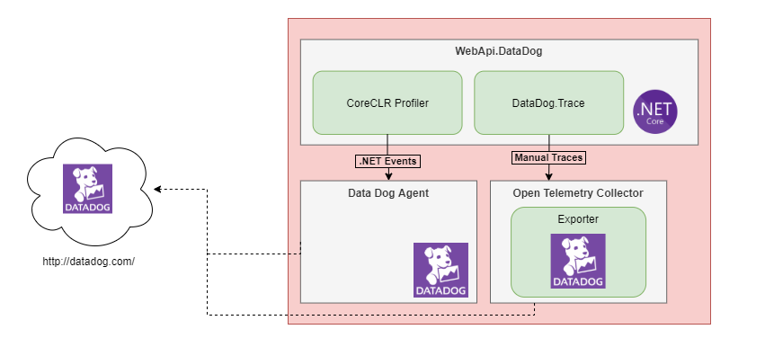
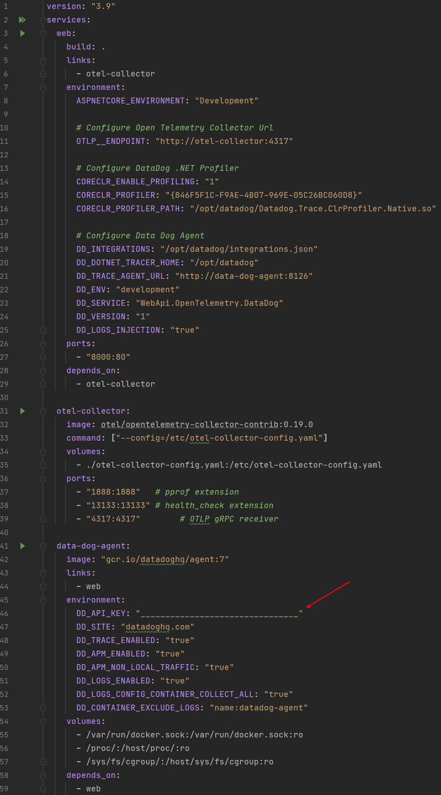
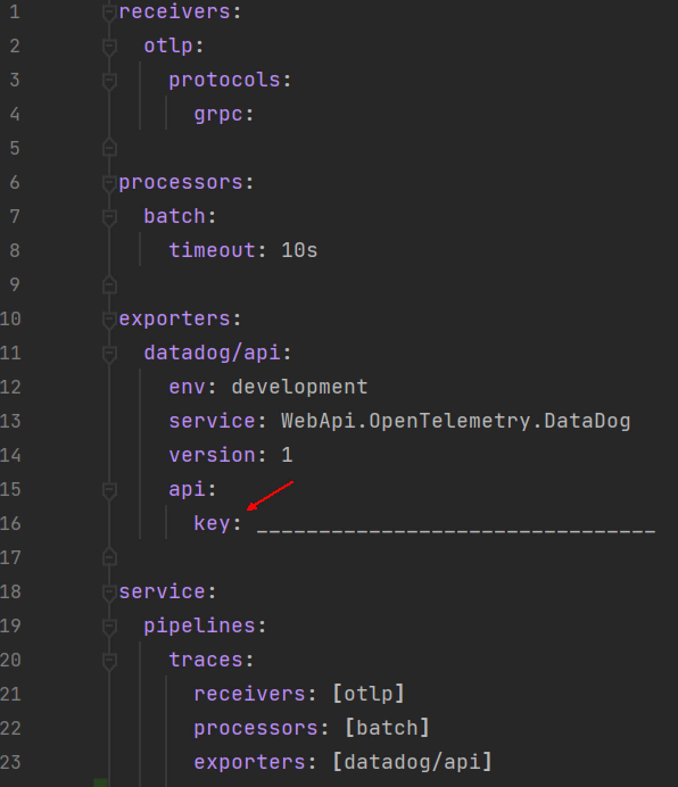

# opentelemetry-datadog
Como configururar o Open Telemetry para funcionar no DataDog.

Essas configurações foram realizadas se baseando na documentação oficial da DataDog: 

Link: https://docs.datadoghq.com/tracing/setup_overview/open_standards/#opentelemetry-collector-datadog-exporter

# Introdução

Este projeto tem como proposito testar e exemplificar o uso do agent DataDog juntamente com o coletor da Open Telemetry.

Segue abaixo um diagrama exemplificando a iteração dos componentes

# Pre-requisitos

- Docker

# Como Executar

1. No arquivo `docker-compose.yml` configure a API Key do Data Dog na variável `DD_API_KEY`;
    

2. No arquivo `otel-collector-config.yaml` configure a API Key do Data Dog na Propriedade Key do Exporter `datadog/api`;
    
    

3. Utilizando um command line de sua preferencia execute o seguinte comando `docker-compose up` na pasta raiz do projeto;

4. Acesse o swagger da aplicação em http://localhost:8000/swagger

5. Execute uma requisição qualquer;

6. Acesse o portal da Data Dog e verifique os traces enviados;

